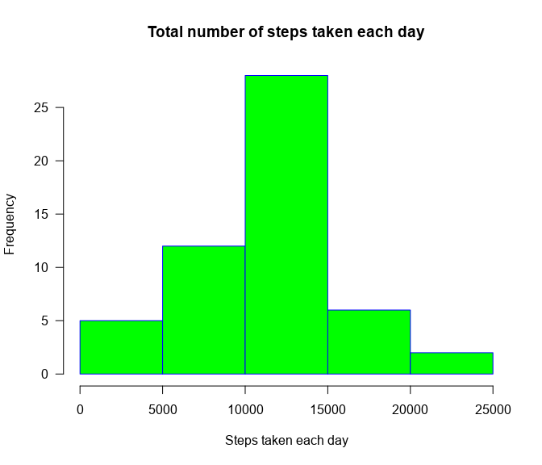
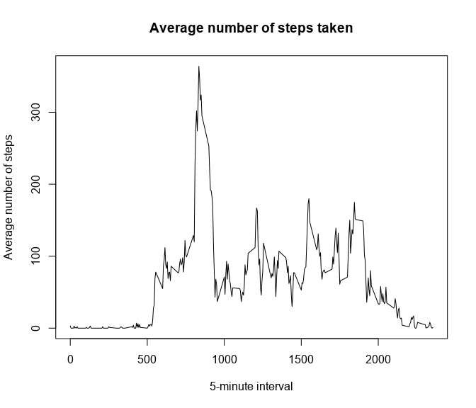
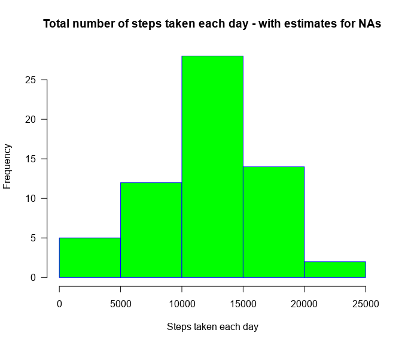
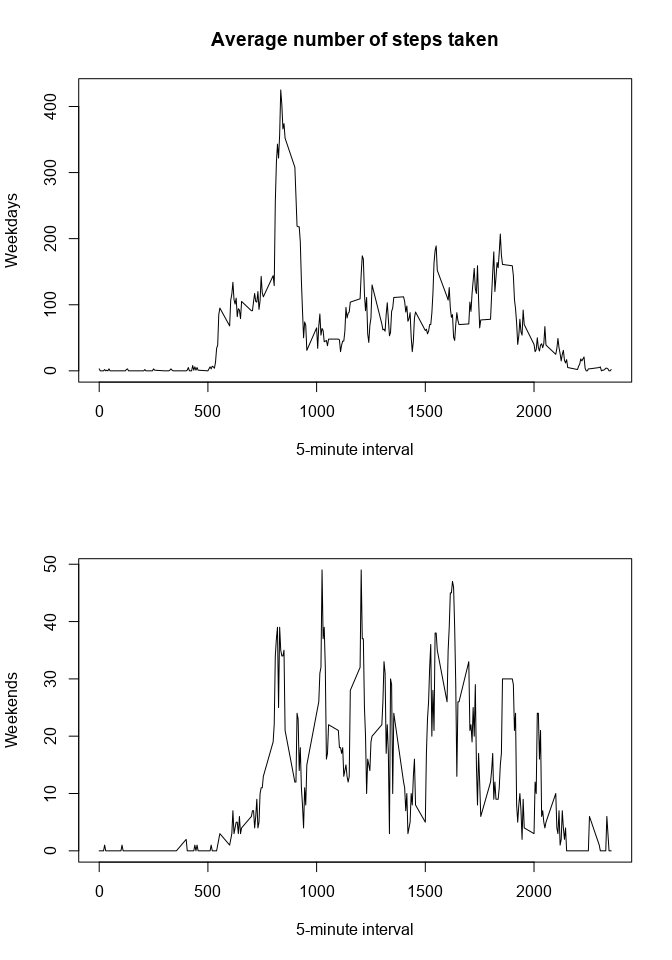

## Loading and preprocessing the data

```r
unzip("activity.zip")
data = read.csv("activity.csv")
```


```r
library("qpcR")
```


## What is mean total number of steps taken per day?


```r
steps<-aggregate(data$steps,by=list(Category=data$date), FUN=sum)
hist(steps$x, main="Total number of steps taken each day", 
     xlab="Steps taken each day", 
     border="blue", 
     col="green",
     las=1, 
     breaks=5)
```

<!-- -->


```r
str(steps)
```

```
## 'data.frame':	61 obs. of  2 variables:
##  $ Category: chr  "2012-10-01" "2012-10-02" "2012-10-03" "2012-10-04" ...
##  $ x       : int  NA 126 11352 12116 13294 15420 11015 NA 12811 9900 ...
```

```r
summary(steps)
```

```
##    Category               x        
##  Length:61          Min.   :   41  
##  Class :character   1st Qu.: 8841  
##  Mode  :character   Median :10765  
##                     Mean   :10766  
##                     3rd Qu.:13294  
##                     Max.   :21194  
##                     NA's   :8
```

The mean of the total number of steps taken per day is: 

```r
as.integer(mean(steps$x, na.rm = TRUE))
```

```
## [1] 10766
```

The median of the total number of steps taken per day is: 

```r
as.integer(median(steps$x, na.rm = TRUE))
```

```
## [1] 10765
```


## What is the average daily activity pattern?


```r
times<-rowsum(data$steps,group = data$interval, na.rm = TRUE)
times<-as.integer(times/30)
times<-qpcR:::cbind.na(data$interval,times)
times<-na.omit(times)
colnames(times)<-c("interval","average")
times<-data.frame(times)
```


```r
plot(times$interval,times$average,type="l", main="Average number of steps taken",
     xlab="5-minute interval",
     ylab="Average number of steps")
```

<!-- -->

The maximum number of steps is contained in the 

```r
times[which.max(times$average),][[1]]
```

```
## [1] 835
```
5-minute interval.

## Imputing missing values
The total number of missing values is:

```r
sum(is.na(data$steps))
```

```
## [1] 2304
```


```r
data_new<-data


for(i in 1:dim(data_new)[1])
{
    
    if (is.na(data_new[i,1]))
    {
        
        temp2<-which(times$interval==data_new[i,3])
        
        data_new[i,1]<-times[temp2,2]
        
    }
    
}

steps_new<-aggregate(data_new$steps,by=list(Category=data_new$date), FUN=sum)
```


```r
hist(steps_new$x, main="Total number of steps taken each day - with estimates for NAs", 
     xlab="Steps taken each day", 
     border="blue", 
     col="green",
     las=1, 
     breaks=5)
```

<!-- -->


```r
str(steps_new)
```

```
## 'data.frame':	61 obs. of  2 variables:
##  $ Category: chr  "2012-10-01" "2012-10-02" "2012-10-03" "2012-10-04" ...
##  $ x       : int  18897 126 11352 12116 13294 15420 11015 18897 12811 9900 ...
```

```r
summary(steps_new)
```

```
##    Category               x        
##  Length:61          Min.   :   41  
##  Class :character   1st Qu.: 9819  
##  Mode  :character   Median :11458  
##                     Mean   :11833  
##                     3rd Qu.:15084  
##                     Max.   :21194
```

The mean of the total number of steps taken per day is: 

```r
as.integer(mean(steps_new$x, na.rm = TRUE))
```

```
## [1] 11832
```

The median of the total number of steps taken per day is: 

```r
as.integer(median(steps_new$x, na.rm = TRUE))
```

```
## [1] 11458
```
Filling the missing values has raised the number of steps, the mean and the medial of the total number of steps taken per day.


## Are there differences in activity patterns between weekdays and weekends?


```r
data_new$day<-as.numeric(strftime(as.Date(data_new$date, "%Y-%m-%d"), "%u"))
data_new$day<-replace(data_new$day,data_new$day<7,0)
data_new$day<-replace(data_new$day,data_new$day==7,1)
data_new$day<-factor(data_new$day,labels = c("weekday","weekend"))


times_weekend<-rowsum(subset(data_new,data_new$day=='weekend')$steps,group = subset(data_new,data_new$day=='weekend')$interval, na.rm = TRUE)
times_weekend<-as.integer(times_weekend/30)
times_weekend<-qpcR:::cbind.na(data$interval,times_weekend)
times_weekend<-na.omit(times_weekend)
colnames(times_weekend)<-c("interval","average")
times_weekend<-data.frame(times_weekend)

times_weekday<-rowsum(subset(data_new,data_new$day=='weekday')$steps,group = subset(data_new,data_new$day=='weekday')$interval, na.rm = TRUE)
times_weekday<-as.integer(times_weekday/30)
times_weekday<-qpcR:::cbind.na(data$interval,times_weekday)
times_weekday<-na.omit(times_weekday)
colnames(times_weekday)<-c("interval","average")
times_weekday<-data.frame(times_weekday)
```


```r
par(mfrow=c(2,1))
plot(times_weekday$interval,times_weekday$average,type="l", xlab="5-minute interval", ylab="Weekdays")
title("Average number of steps taken")
plot(times_weekend$interval,times_weekend$average,type="l", xlab="5-minute interval", ylab="Weekends")
```

<!-- -->

From the plot we can see that while at weekdays most steps are centered between the 800th and 1000th 5-minute interval, at weekends the steps are more scattered between the 800th and 2000th 5-minute interval.
